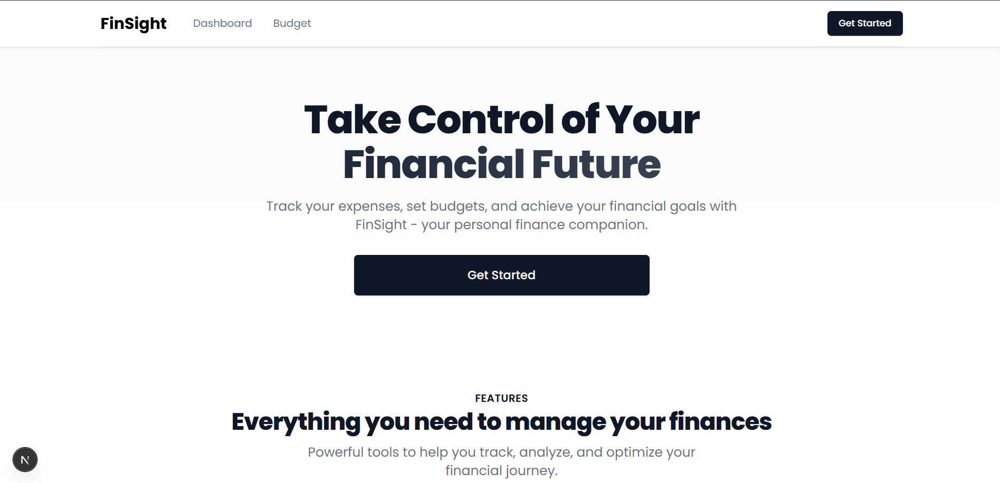
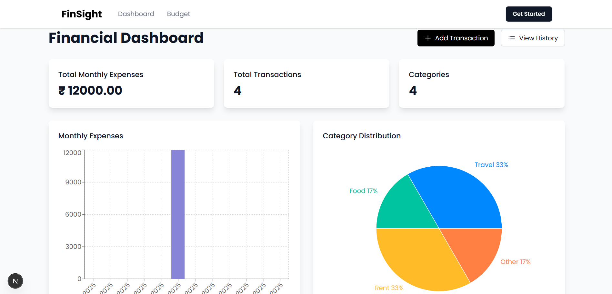
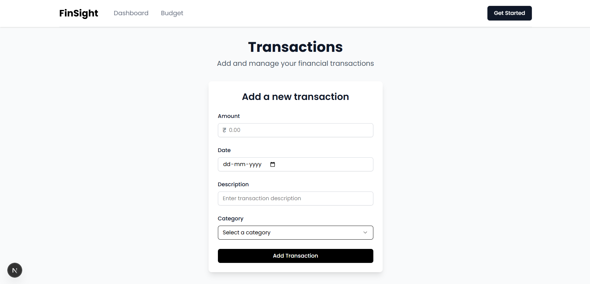
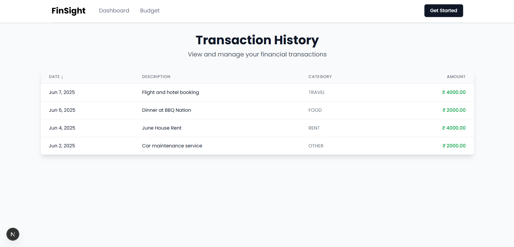
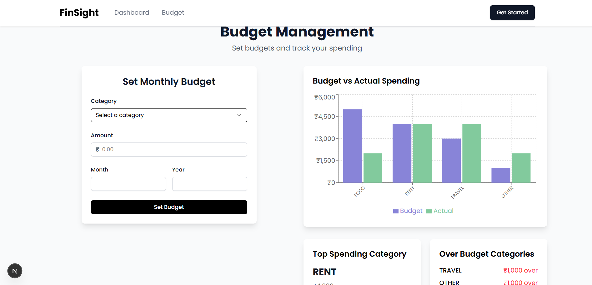

# FinSight – Personal Finance Tracker

FinSight is a full-stack personal finance tracker that allows users to manage their daily expenses, set monthly budgets per category, and gain valuable insights from their spending behavior. It features a clean UI, charts, and real-time feedback based on budget utilization.

---

## 📌 Project Overview

FinSight is built using modern full-stack tools like **Next.js**, **PostgreSQL**, and **Prisma**, with optional support for **Redis caching**. The app allows users to:

- Add, edit, and delete transactions
- Set monthly budgets per category
- Visualize spending and budget data via charts
- Receive smart insights (like over-budget alerts)

---

## ✅ Features Implemented

### 🎯 Stage 1 – Transaction Tracker
- [x] Add, edit, delete transactions (amount, date, description, category)
- [x] View all transactions
- [x] Monthly expense bar chart
- [x] Form validation using `react-hook-form`

### 🎯 Stage 2 – Data Visualization
- [x] Pie chart of category-wise expenses
- [x] Monthly expense trends
- [x] Chart tooltips and legends

### 🎯 Stage 3 – Budgeting & Insights
- [x] Set monthly budgets per category
- [x] Budget vs actual comparison chart (Recharts)
- [x] Smart insights:
  - Over-budget alerts
  - Top spending category
  - Spending trends

---

## ⚙️ Tech Stack

- **Frontend**: Next.js (App Router), Tailwind CSS, shadcn/ui
- **Backend**: Prisma ORM, Next.js API routes
- **Database**: 
  - Local: PostgreSQL (Docker)
  - Production: Prisma Data Platform (Hosted PostgreSQL)
- **Charts**: Recharts
- **Form Handling**: React Hook Form
- **Optional**: Redis (via Upstash)

---

## 🚀 Live Deployment

- **Frontend (Vercel)**: [https://finsight.vercel.app](https://finsight.vercel.app)
- **GitHub Repo**: [https://github.com/tejaspokale22/finsight](https://github.com/your-username/finsight)

---

## 🛠️ Local Setup Instructions

### 🔹 1. Clone the Repository

```bash
git clone https://github.com/your-username/finsight.git
cd finsight
```

### 🔹 2. Install Dependencies

```bash
npm install
```

### 🔹 3. Local Database Setup (Docker)

```bash
# Start PostgreSQL container
docker run --name finsight-db \
  -e POSTGRES_USER=postgres \
  -e POSTGRES_PASSWORD=admin \
  -e POSTGRES_DB=finsight \
  -p 5432:5432 \
  -v postgres_data:/var/lib/postgresql/data \
  -d postgres
```

### 🔹 4. Environment Setup

Create a `.env` file in the root directory:

```env
# Local Development
DATABASE_URL="postgresql://<username>:<password>@<host>:<port>/<database_name>"

# Production (Prisma Data Platform)
# DATABASE_URL="your-prisma-hosted-postgres-url"
```

### 🔹 5. Prisma Setup

```bash
# Generate Prisma Client
npx prisma generate

# Push schema to database
npx prisma migrate dev --name finsight-db
```

### 🔹 6. Start Development Server

```bash
npm run dev
```

Visit: [http://localhost:3000](http://localhost:3000)

---

## 🌐 Production Deployment

### 🔹 1. Prisma Data Platform Setup

1. Sign up for [Prisma Data Platform](https://cloud.prisma.io)
2. Create a new project
3. Choose PostgreSQL as your database
4. Copy the connection URL provided by Prisma
5. Add the connection URL to your production environment variables

### 🔹 2. Vercel Deployment

1. Push your code to GitHub
2. Connect your repository to Vercel
3. Add the following environment variables in Vercel:
   - `DATABASE_URL`: Your Prisma hosted PostgreSQL URL
   - Any other required environment variables

### 🔹 3. Database Migration

```bash
# Generate Prisma Client
npx prisma generate

# Push schema to production database
npx prisma migrate dev --name finsight-db
```

---

## 📊 Screenshots


*Dashboard Overview - Main interface showing transaction list and summary*


*Transaction Management - Add and manage your expenses*


*Budget Settings - Configure monthly budgets per category*


*Expense Analytics - Visualize your spending patterns*


*Smart Insights - Get valuable insights about your spending behavior*

---

## 🙌 License

This project is open-source and free to use under the MIT License.

---

## ✨ Author

* [Tejas Pokale](https://github.com/tejaspokale22)
* [LinkedIn](https://www.linkedin.com/in/tejaspokale22)
